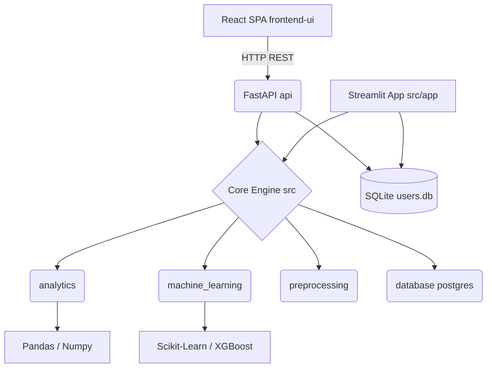

# Dependency Graph

## Internal Architecture Rules
1. `frontend-ui` must NEVER directly access the database. It must route entirely through `api/`.
2. `src/` modules should be stateless and callable by either FastAPI or Streamlit.
3. `api/` endpoints should primarily handle authentication, validation, and request routing, delegating heavy computation to `src/`.
