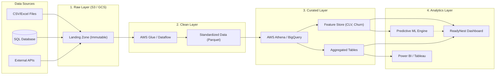

# Enterprise Cloud Data Lake Architecture

To support the ReadyNest analytics platform at enterprise scale, we propose a multi-layered Cloud Data Lake architecture. This allows for massive scalability, decoupled storage and compute, and centralized governance.

## Architecture Flow Diagram

The following diagram illustrates the flow of data from ingestion through the Data Lake layers, terminating at the Visualization Engine (Power BI / Streamlit).

## Storage Layers

### 1. Raw Layer (Landing Zone)
- **Technology:** AWS S3 / Google Cloud Storage
- **Purpose:** Immutable storage of exact data dumps from source systems.
- **Format:** CSV, JSON, raw SQL dumps.
- **Rule:** Data is never deleted or modified here.

### 2. Clean Layer (Standardized)
- **Technology:** AWS Glue / Apache Spark
- **Purpose:** Schema enforcement, null handling, and datatype conversion.
- **Format:** Apache Parquet (Columnar for fast querying).
- **Rule:** Partitioned by Date (e.g., `year=2026/month=06`).

### 3. Curated Layer (Analytics Ready)
- **Technology:** AWS Athena / Google BigQuery
- **Purpose:** Aggregated business metrics, Feature Engineering (CLV, Recency), and join tables.
- **Rule:** Data here is ready for immediate consumption by BI tools.

### 4. Analytics Layer (Consumption)
- **Technology:** Power BI Service, Tableau Server, or Python Streamlit App.
- **Purpose:** Executive dashboards, automated reporting, and exploratory data analysis.

> [!TIP]
> **Partitioning Strategy**: For high-performance queries in Athena/BigQuery, ensure the Clean Layer Parquet files are partitioned by `Region` and `Date`.
